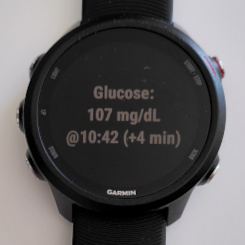
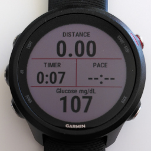
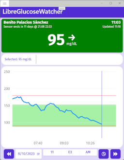
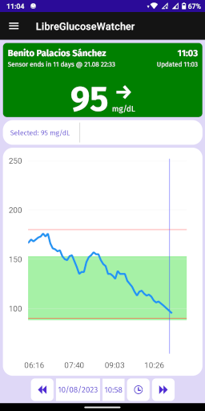

# Libre Glucose Watcher 

> **Not for treatment decisions**
>
> The information presented in these apps should not be used for treatment or
> dosing decisions. Consult the glucose-monitoring system and/or a healthcare
> professional.

> **Prototype status**
>
> This repository contains only prototype software. It's developed at fast pace
> without considering the quality. The projects do not have any quality
> standards like tests, CI or documentation. The code may have performance
> issues and bad design patterns. Check it or use it at your own risk.

Applications to monitor glucose levels from _FreeStyle Libre_ sensors (via
_LibreLinkUp_ app connection). These applications do not connect to the sensor
directly but download the most recent data from servers. They require Internet
connection.

**`#WeAreNotWaiting`**

## Available projects

### Garmin sport watches

- Tested on: Garmin Forerunner 245 Music.
- Settings to configure account and glucose units.
- It updates every 5 minutes (due to Garmin API limitations).
- Requires connection to paired phone and Internet.

**Widget for the main menu showing latest value available.**

**Data field to use during activities (e.g. running, hiking).**

#### Garmin - Installation

This is a _personal use **at your own risk**_ application. For that reason, it's
not published to the Connect IQ store. If you want to play and give it a try,
you will need to perform a manual installation as follow:

1. Follow the [compile](#garmin---compile) steps.
   - You may want to add compatibility to your product. Usually it would be just
     adding your watch model in the `manifest.xml` file by running the command
     _Monkey C: Edit Products_.
2. Connect your Garmin device into your computer.
3. Copy the generated `*.prg` file into the Garmin device folder `GARMIN/APPS`.
4. Due to a limitation in Garmin, we can't use the setting UI from Garmin
   Connect to set the user name and password (see
   [issue](https://forums.garmin.com/developer/connect-iq/f/discussion/2121/modifying-settings-on-side-loaded-app)).
   Follow this step instead:
   1. Open the project with VS Code.
   2. Open any \*.mc file.
   3. Go to the tab "_Run and Debug_" and click its button. It will compile and
      run the simulator.
   4. Set your email and password in the simulator from _File > Edit Persistent
      Storage > Edit Application.Properties data_
   5. Copy the setting file from the simulator (temp folder, in Windows at
      `%TEMP%\com.garmin.connectiq\GARMIN\APPS\SETTINGS`) into your Garmin
      device: `/garmin/apps/settings`.

#### Garmin - Compile

1. Install Garmin Connect IQ SDK and generate a developer license following
   [their instructions](https://developer.garmin.com/connect-iq/connect-iq-basics/getting-started/).
2. Open VS Code in the subfolder of the project to compile. A file
   `monkey.jungle` must be in the top-level workspace.
3. Run the VS Code command "_Build for Device_".

### Desktop and mobile

- Uses .NET MAUI: compatible with Windows, MacOS, Android and iOS (and any new
  future platform).
  - Tested on Windows and Android.
- Updates every minute. Recent changes from LibreLinkUp servers seems to only
  update every 15 minutes their data.
- Requires Internet connection.

#### .NET - Installation

As it's prototype application, no binaries are provided. Follow the steps in
[compile](#net---compile) to generate the application.

- **Windows**: after compiling run the following command to create a portable
  binary:
  `dotnet publish -f net7.0-windows10.0.19041.0 -c Release -p:WindowsPackageType=None`
- **Android**: the easiest is to start debugging from Visual Studio. It will
  install the application the first time. Then you can open it from your phone
  without requiring VS.

#### .NET - Compile

1. Install .NET 7 and MAUI following
   [these steps](https://learn.microsoft.com/en-us/dotnet/maui/get-started/installation).
2. Build it using command-line or an IDE. You can use
   [these steps](https://learn.microsoft.com/en-us/dotnet/maui/get-started/first-app)
   as a reference, but opening `LibreGlucoseWatcher.sln` instead of creating a
   new application.

## Attribution

[Icon by Freepik](https://www.freepik.com/icon/tamagotchi_2946172)

## Roadmap

Garmin:

- Update data field app
- Create barrel
- Refactor into client + background class
- Display timestamp of last value
- Display arrow of graph
- Display message if value is quite old (> 5 min)
- Alert when it reaches threshold low and high
- Show data with colors
- Add graph like Dexcom app

Desktop / Mobile:

- Clean-up code
- Use selected units
- Create foreground service
- Show value in mobile notification
- Ring alarm (configurable) in phone
- Use Windows popups to display alerts
- Store values in a database
- Calculate stats (e.g. average, percentage, Hb1ac, histograms)
